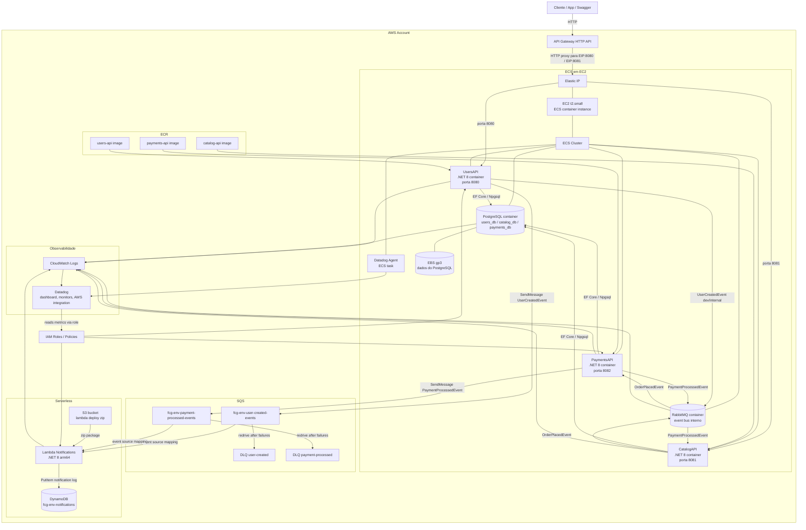
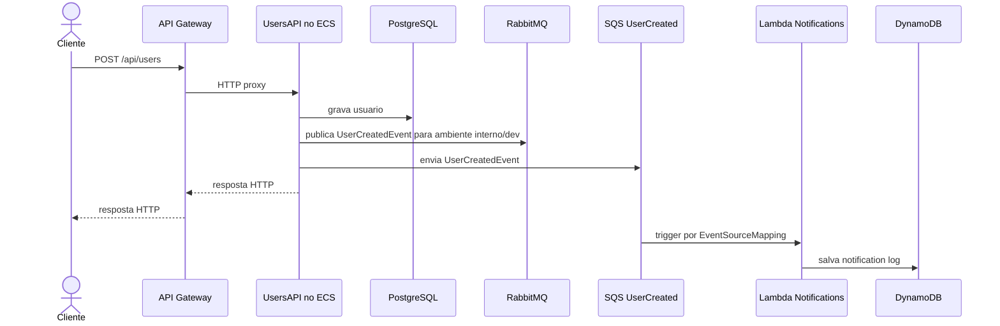
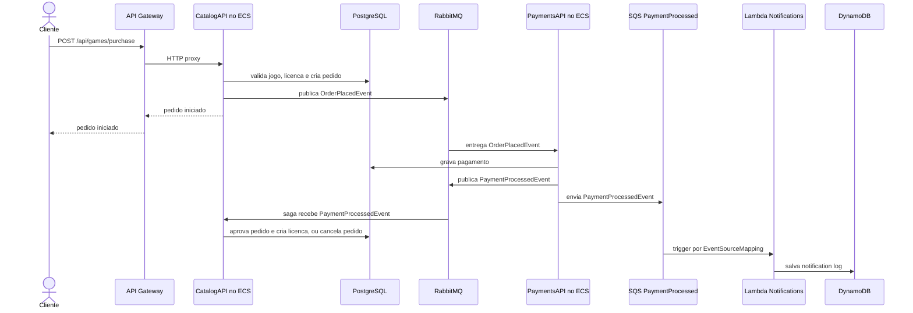

# FiapCloudGames - Arquitetura AWS

Este desenho reflete a infraestrutura declarada hoje em `Orchestration/infrastructure/terraform`.

## Desenho geral

## Como a AWS esta sendo usada

| Area | AWS usada | Uso no projeto |
|---|---|---|
| Entrada HTTP | API Gateway HTTP API | Ponto unico de entrada para rotas de `UsersAPI` e `CatalogAPI`, usando o Elastic IP da EC2 como destino HTTP proxy. |
| Containers | ECS em EC2 | Roda `UsersAPI`, `CatalogAPI`, `PaymentsAPI`, `PostgreSQL`, `RabbitMQ` e `Datadog Agent`. |
| Imagens | ECR | Armazena as imagens Docker das tres APIs. |
| IP publico | Elastic IP | Expoe a instancia EC2 usada pelo API Gateway como destino HTTP proxy. |
| Persistencia relacional | PostgreSQL em container + EBS | Um container PostgreSQL guarda `users_db`, `catalog_db` e `payments_db`; o volume EBS preserva os dados. |
| Mensageria interna | RabbitMQ em container no ECS | Orquestra o fluxo de compra entre `CatalogAPI` e `PaymentsAPI`, e alimenta a saga do catalogo. |
| Mensageria gerenciada | SQS + DLQ | Recebe eventos assicronos para notificacoes: `UserCreatedEvent` e `PaymentProcessedEvent`. |
| Serverless | Lambda .NET 8 arm64 | Processa eventos do SQS e cria logs de notificacao. |
| NoSQL | DynamoDB | Armazena registros de notificacoes, com GSI por `userId/createdAt`, TTL e PITR. |
| Deploy Lambda | S3 | Guarda o pacote `.zip` usado pela Lambda. |
| Logs | CloudWatch Logs | Recebe logs de ECS e Lambda. |
| Observabilidade | Datadog + IAM integration | Coleta metricas AWS, traces, logs, dashboards e monitores. |
| Permissoes | IAM | Permite ECS publicar no SQS, Lambda consumir SQS/escrever DynamoDB e Datadog ler metricas. |

`PaymentsAPI` esta no ECS, mas nao aparece como rota do API Gateway no Terraform atual; ela consome `OrderPlacedEvent` pelo RabbitMQ e publica `PaymentProcessedEvent`.

## Fluxo 1 - Cadastro de usuario

## Fluxo 2 - Compra de jogo

## Observacao importante

O README menciona EKS, RDS e ElastiCache como evolucao/arquitetura alvo em alguns pontos. Ja o Terraform atual deste repositorio provisiona ECS em EC2, PostgreSQL e RabbitMQ como containers, SQS, Lambda, DynamoDB, API Gateway, ECR, S3, CloudWatch e Datadog. Este desenho segue o que esta declarado no Terraform.
