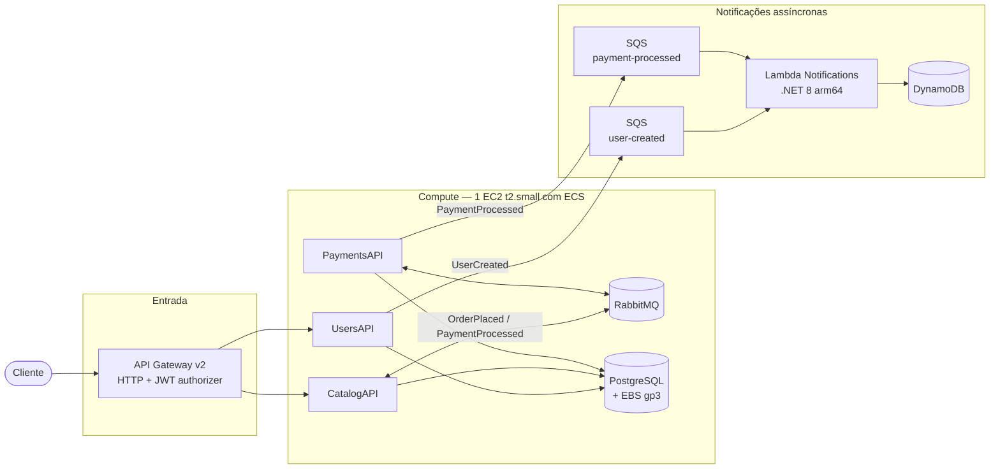
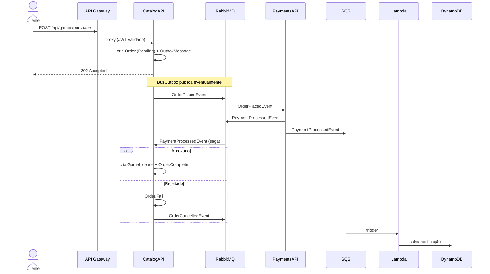

# FiapCloudGames — Arquitetura AWS

Reflete o que está em `infrastructure/terraform/`.

## Diagrama

Cada fila SQS tem uma DLQ. ECR guarda as imagens das 3 APIs.
CloudWatch Logs recebe logs de ECS e Lambda; Datadog (agent em ECS + AWS
integration role) cobre métricas/traces.

## Recursos AWS usados

| Serviço | Para quê |
|---|---|
| API Gateway v2 (HTTP) | Entrada única, autoriza JWT (RS256), faz proxy HTTP para o EIP da EC2 |
| ECS em **uma** EC2 t2.small | Roda 6 tasks: 3 APIs + Postgres + RabbitMQ + Datadog agent |
| ECR | Imagens Docker das 3 APIs |
| EBS gp3 | Volume persistente do Postgres |
| Elastic IP | IP estável da EC2, usado pelo API Gateway |
| SQS (+ DLQ) | `user-created-events` e `payment-processed-events`, consumidos pela Lambda |
| Lambda + S3 | Notifications λ (zip no S3); event source mapping em ambas as filas |
| DynamoDB | Tabela `notifications` (log de envios, TTL ativo) |
| CloudWatch Logs | Logs de todas as tasks ECS e da Lambda |
| Datadog | Agent em ECS + role AWS integration |
| IAM | Permissões: ECS publica em SQS; Lambda lê SQS e escreve DynamoDB; Datadog lê métricas |

## Fluxo de compra

O cadastro de usuário segue o mesmo padrão simplificado: `POST /api/users`
→ UsersAPI grava no Postgres → envia `UserCreatedEvent` pro SQS → Lambda
grava no DynamoDB.
