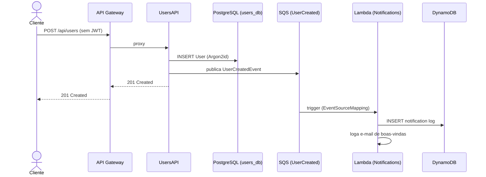
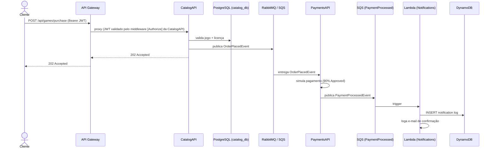

# FiapCloudGames — Orquestração

Repositório central de orquestração da plataforma **FiapCloudGames**: Docker Compose para desenvolvimento local, manifests Kubernetes (Kustomize) para dev/prod e infraestrutura AWS como código (Terraform).

---

## Sumário

- [Evolução da Arquitetura](#evolução-da-arquitetura)
- [Fase 3 — Arquitetura AWS (atual)](#fase-3--arquitetura-aws-atual)
- [Stack de Tecnologias](#stack-de-tecnologias)
- [Fluxos de Eventos](#fluxos-de-eventos)
- [Executando com Docker Compose](#executando-com-docker-compose)
- [Deploy no Kubernetes](#deploy-no-kubernetes)
- [Deploy AWS (Terraform)](#deploy-aws-terraform)
- [Observabilidade — Datadog APM](#observabilidade--datadog-apm)
- [Repositórios dos Microsserviços](#repositórios-dos-microsserviços)

---

## Evolução da Arquitetura

| Fase | Descrição | Destaque |
|------|-----------|---------|
| **Fase 1** | Monolito .NET 8 | Banco único, sem mensageria |
| **Fase 2** | Microsserviços + RabbitMQ | 4 serviços independentes, MassTransit, K8s |
| **Fase 3** | Arquitetura AWS profissional | Lambda, SQS, DynamoDB, API GW, Redis, Observabilidade |

---

## Fase 3 — Arquitetura AWS (atual)

```
                    ┌─────────────────────────────────┐
                    │       AWS API Gateway            │
                    │   (CORS + Throttling + Rotas)    │
                    └────────────┬────────────┬────────┘
                                 │            │
              ┌──────────────────▼──┐    ┌────▼─────────────────┐
              │      UsersAPI       │    │      CatalogAPI       │
              │   (K8s / EKS)       │    │    (K8s / EKS)        │
              │  ┌───────────────┐  │    │  ┌────────────────┐   │
              │  │ PostgreSQL    │  │    │  │ PostgreSQL     │   │
              │  │ (RDS)         │  │    │  │ (RDS)          │   │
              │  └───────────────┘  │    │  └────────────────┘   │
              │  ┌───────────────┐  │    │  ┌────────────────┐   │
              │  │ Redis Cache   │◄─┼────┼─►│ Redis Cache    │   │
              │  │ (ElastiCache) │  │    │  │ (ElastiCache)  │   │
              │  └───────────────┘  │    │  └────────────────┘   │
              └──────────┬──────────┘    └────────┬──────────────┘
                         │                        │
                         │  publica               │  publica
                         ▼                        ▼
              ┌─────────────────┐      ┌─────────────────────────┐
              │ SQS Queue       │      │ PaymentsAPI (K8s / EKS) │
              │ UserCreated     │      │  └─► SQS Queue          │
              │ Events          │      │      PaymentProcessed   │
              └────────┬────────┘      │      Events             │
                       │               └────────────┬────────────┘
                       │                            │
                       └──────────┬─────────────────┘
                                  │ trigger
                                  ▼
                    ┌─────────────────────────────────┐
                    │       AWS Lambda                 │
                    │   NotificationsFunction          │
                    │   (fcg-notifications-production) │
                    │                                  │
                    │  ┌───────────────────────────┐  │
                    │  │ DynamoDB                  │  │
                    │  │ fcg-notifications          │  │
                    │  │ (log de notificações)      │  │
                    │  └───────────────────────────┘  │
                    └─────────────────────────────────┘

                    ┌─────────────────────────────────┐
                    │   Observabilidade — Datadog      │
                    │   APM + Logs + Traces + Metrics  │
                    │   (Agent DaemonSet no K8s +      │
                    │    Datadog Extension na Lambda)  │
                    └─────────────────────────────────┘
```

---

## Stack de Tecnologias

### API Gateway
- **AWS API Gateway (HTTP API v2)** — ponto de entrada único com roteamento, CORS, throttling e **JWT Authorizer nativo** (RS256) para UsersAPI e CatalogAPI
- Tokens são assinados em RSA pela UsersAPI; o gateway busca a chave pública via JWKS endpoint (`/.well-known/jwks.json`)
- Rotas públicas (sem JWT): `POST /api/users` (cadastro), `POST /api/users/login`, `GET /.well-known/*`
- Em desenvolvimento, o gateway é representado por um proxy reverso Nginx (`infrastructure/nginx/nginx.conf`) que reproduz rotas, CORS e throttling. A validação JWT em dev acontece nas próprias APIs
- Configuração de produção: `infrastructure/terraform/api_gateway.tf`

### Serverless — NotificationsAPI
- **AWS Lambda** (.NET 8, arm64) — substitui o container que rodava continuamente
- **Trigger**: Amazon SQS (EventSourceMapping direto, sem polling manual)
- **Persistência**: Amazon DynamoDB (persistência poliglota — NoSQL)
- Código: pasta `NotificationsLambda/` neste repositório
- IaC: `infrastructure/terraform/lambda.tf`

### Mensageria
| Ambiente | Broker |
|----------|--------|
| Desenvolvimento local | RabbitMQ 3.13 (Docker) |
| Produção AWS | Amazon SQS (gerenciado, sem servidor) |

### Cache
- **Redis 7.2** via `StackExchange.Redis` / `IDistributedCache` do ASP.NET Core
- Desenvolvimento: container Docker
- Produção AWS: Amazon ElastiCache for Redis

### Persistência Poliglota
| Serviço | Banco |
|---------|-------|
| UsersAPI | PostgreSQL (RDS) |
| CatalogAPI | PostgreSQL (RDS) |
| PaymentsAPI | PostgreSQL (RDS) |
| NotificationsAPI | **DynamoDB** (NoSQL — log de notificações) |

### Observabilidade — Opção B (Datadog APM)
- **Datadog Agent 7.58** — DaemonSet no K8s que coleta traces (APM), métricas e logs de todos os containers
- **Datadog .NET Tracer** (`Datadog.Trace.Bundle` NuGet) — auto-instrumentation de ASP.NET Core, EF Core, Npgsql, StackExchange.Redis, MassTransit/RabbitMQ, HttpClient, sem mudança de código
- **Datadog Lambda Extension** — layer pública (`Datadog-Extension-ARM`) anexada à Lambda de Notificações para forwarding de traces, logs e métricas diretamente da AWS
- **API Key** gerenciada via Kubernetes Secret (`datadog-secret`) e variável sensível do Terraform (`dd_api_key`)
- Deploy K8s: `k8s/base/datadog-agent.yaml` (DaemonSet + ServiceAccount/RBAC + ConfigMap)
- Cobertura dos 3 pilares: métricas (APM + runtime metrics), logs (`DD_LOGS_INJECTION=true` correlaciona trace_id/span_id), traces distribuídos (incluindo o fluxo "Compra de Jogo": API Gateway → CatalogAPI → RabbitMQ → PaymentsAPI → SQS → Lambda → DynamoDB)

---

## Fluxos de Eventos

### 1. Cadastro de Usuário



### 2. Compra de Jogo (fluxo completo)



---

## Executando com Docker Compose

### Pré-requisitos
- Docker Desktop com Compose

### Iniciar todos os serviços

```bash
cp .env.example .env   # edite as variáveis (inclui DD_API_KEY e DD_SITE)

# Gere o par de chaves RSA (assinatura de JWTs) — segue o output do script
# adicionando JWT_RSA_PRIVATE_KEY e JWT_RSA_PUBLIC_KEY ao seu .env
bash infrastructure/scripts/generate-jwt-keys.sh

# Empacote a NotificationsLambda — necessário para o fluxo SQS → Lambda → DynamoDB
bash infrastructure/localstack/build-lambda.sh
# Windows: pwsh infrastructure/localstack/build-lambda.ps1

docker compose up --build
```

> **AWS local com LocalStack**: o `docker-compose.yml` sobe um container
> `localstack` que emula SQS, DynamoDB, Lambda, S3 e CloudWatch Logs. O script
> `infrastructure/localstack/init-aws.sh` cria automaticamente filas + DLQs
> (`fcg-local-user-created-events`, `fcg-local-payment-processed-events`),
> a tabela DynamoDB `fcg-local-notifications`, o bucket de deploy e a função
> Lambda com event source mappings nas duas filas — reproduzindo o fluxo de
> produção sem custo em nuvem.

> **Datadog local**: o `datadog-agent` só sobe corretamente com uma `DD_API_KEY` válida.
> Se quiser rodar sem Datadog, comente o serviço `datadog-agent` no `docker-compose.yml`
> e remova as envs `DD_*` dos 3 microsserviços.

### URLs disponíveis

| Serviço | URL |
|---------|-----|
| UsersAPI (Swagger) | http://localhost:5001/swagger |
| CatalogAPI (Swagger) | http://localhost:5002/swagger |
| PaymentsAPI (health) | http://localhost:5003/health |
| RabbitMQ Management | http://localhost:15672 |
| Redis | localhost:6379 |
| users-postgres | localhost:5432 |
| catalog-postgres | localhost:5433 |
| payments-postgres | localhost:5434 |
| LocalStack (edge) | http://localhost:4566 |
| **API Gateway (Nginx)** | **http://localhost:8080** — entrypoint único |

> **NotificationsAPI** — em produção roda como AWS Lambda gerenciada (provisionada
> pelo Terraform). Em desenvolvimento (Compose), o LocalStack hospeda a mesma
> função `.NET 8` lida do `.zip` gerado por
> `infrastructure/localstack/build-lambda.sh`, com event source mappings reais
> nas filas SQS — fluxo end-to-end sem dependência de cloud.

### Acesso às APIs em dev

Em produção o entrypoint é o **AWS API Gateway HTTP API v2** provisionado
pelo Terraform. Como HTTP API v2 não é emulado no LocalStack Community
(é Pro), em dev usamos **Nginx** como proxy reverso reproduzindo as
mesmas rotas, CORS e throttling do gateway real. O entrypoint local é:

```
http://localhost:8080
```

```bash
# Cadastro de usuário (mesmo path do gateway de produção)
curl -X POST http://localhost:8080/api/users \
  -H "Content-Type: application/json" \
  -d '{"name":"Demo","email":"demo@fgc.com","password":"Demo@123"}'

# Catálogo de jogos
curl http://localhost:8080/api/games

# Health do gateway
curl http://localhost:8080/health
```

Acessar as portas individuais (`5001`/`5002`/`5003`) continua funcionando
para debug pontual, mas o caminho recomendado é via `8080` — que é o
mesmo padrão de produção (uma URL, vários microsserviços abstraídos).

### Inspecionar recursos AWS locais

```bash
# Listar filas
docker exec fcg-localstack awslocal sqs list-queues

# Espiar mensagens na fila de cadastro
docker exec fcg-localstack awslocal sqs receive-message \
  --queue-url http://localhost:4566/000000000000/fcg-local-user-created-events

# Ler notificações persistidas
docker exec fcg-localstack awslocal dynamodb scan \
  --table-name fcg-local-notifications

# Bucket de deploy da Lambda
docker exec fcg-localstack awslocal s3 ls s3://fcg-local-lambda-deploy

# Logs da Lambda
docker exec fcg-localstack awslocal logs describe-log-groups
docker exec fcg-localstack awslocal logs filter-log-events \
  --log-group-name /aws/lambda/fcg-local-notifications \
  --limit 50 --query 'events[].message' --output text
```

### Cobertura AWS ↔ LocalStack

| Recurso AWS (Terraform) | Em LocalStack? | Substituto local |
|---|---|---|
| `aws_sqs_queue` (filas + DLQs) | ✅ emulado |  |
| `aws_dynamodb_table` | ✅ emulado |  |
| `aws_lambda_function` | ✅ Compose (LocalStack) · AWS gerenciado em produção | — |
| `aws_lambda_event_source_mapping` | ✅ Compose (LocalStack) · AWS gerenciado em produção | — |
| `aws_apigatewayv2_api` + rotas | ⚠️ **LocalStack Pro only** (HTTP API v2) | **Nginx** em `http://localhost:8080` reproduzindo as mesmas rotas, CORS e throttling — `infrastructure/nginx/nginx.conf` |
| `aws_s3_bucket` (lambda deploy) | ✅ emulado |  |
| `aws_cloudwatch_log_group` | ✅ emulado |  |
| `aws_iam_role` / policy | ✅ aceito (não enforced em local) |  |
| `aws_ecs_cluster` / `aws_ecs_service` | ❌ requer LocalStack Pro | Containers do Compose / Pods do K8s |
| `aws_instance` (EC2) | ❌ não emulável de forma útil | Containers / Pods |
| `aws_ebs_volume` / `aws_eip` / `aws_security_group` | ❌ irrelevante em local | Volumes Docker / networking nativo |
| `aws_ecr_repository` | ❌ desnecessário | `docker build` direto na imagem `:latest` |

A coluna **"Substituto local"** mostra como o item é coberto sem AWS: as APIs que rodariam em ECS/EC2 viram containers no Compose ou pods no K8s, mantendo o mesmo comportamento de aplicação (porque a imagem do app é a mesma — só o orquestrador muda).

### Autenticação JWT (RSA RS256)

A UsersAPI emite tokens JWT assinados com **RSA** (algoritmo `RS256`),
permitindo que o **AWS API Gateway HTTP API v2 JWT Authorizer nativo** valide
os tokens em produção sem precisar de Lambda authorizer. A chave pública é
publicada pela UsersAPI no endpoint padrão OIDC.

| Endpoint | Função |
|---|---|
| `/.well-known/jwks.json` | Chave pública em formato JWK (`kid: fcg-rsa-1`) |
| `/.well-known/openid-configuration` | Metadata OIDC (issuer + jwks_uri + algs) |

**Gerar as chaves localmente** (antes da primeira subida do Compose ou Terraform):

```bash
bash infrastructure/scripts/generate-jwt-keys.sh
```

O script gera o par em `.keys/private.pem` + `.keys/public.pem` (gitignored)
e imprime as variáveis prontas para o `.env`:
```
JWT_RSA_PRIVATE_KEY=<base64 do PEM da chave privada>
JWT_RSA_PUBLIC_KEY=<base64 do PEM da chave pública>
```

**Distribuição de chaves** por ambiente:

| Serviço | Chave privada | Chave pública |
|---|---|---|
| UsersAPI | ✅ (para assinar tokens + servir o JWKS) | ✅ |
| CatalogAPI | — | ✅ (validar tokens) |
| PaymentsAPI | — | ✅ (validar tokens) |
| AWS API Gateway | — | Busca via JWKS endpoint dinamicamente |

> O AWS API Gateway só suporta JWT Authorizer com algoritmos RSA/ECDSA
> (HMAC `HS256` não é aceito). Por isso a escolha por RSA.

### Credenciais de teste (seed automático)

Na primeira subida, a UsersAPI cria automaticamente o usuário admin via
`UsersDbSeeder` (Clean Architecture — `Users.Infrastructure/Persistence/Seed/`).
A criação é idempotente.

| E-mail | Senha | Role |
|--------|-------|------|
| `admin@fgc.com` | `Admin@123` | Admin |

Outros usuários podem ser cadastrados via `POST /api/users`.

---

## Deploy no Kubernetes

Os manifests são gerenciados via **Kustomize** (nativo no `kubectl`):
um único `k8s/base/` é compartilhado entre ambientes, e cada `overlay`
injeta o que é específico do ambiente (LocalStack em dev, URLs reais
do Terraform em prod).

### Estrutura

```
k8s/
├── base/                              # Manifests comuns (todos os ambientes)
│   ├── kustomization.yaml             # Lista resources + configMapGenerator
│   ├── namespace.yaml
│   ├── network-policies.yaml
│   ├── users-postgres.yaml + secret
│   ├── catalog-postgres.yaml
│   ├── payments-postgres.yaml
│   ├── postgres-secrets.yaml
│   ├── rabbitmq.yaml + secret
│   ├── redis.yaml + secret
│   ├── users-api.yaml + secret       # Service em :8080
│   ├── catalog-api.yaml + secret
│   ├── payments-api.yaml + secret
│   ├── api-gateway.yaml              # Nginx — entrypoint único em :8080
│   ├── swagger-ui.yaml               # Swagger UI carregando spec curado
│   ├── ingress.yaml
│   ├── datadog-agent.yaml + secret   # DaemonSet + RBAC + checks customizados
│   └── bootstrap.sh / kind-config.yaml
└── overlays/
    ├── local/                         # Cluster local (Docker Desktop / kind / minikube)
    │   ├── kustomization.yaml
    │   ├── localstack.yaml           # LocalStack (SQS + DynamoDB + S3 + Logs)
    │   └── sqs-secrets.yaml          # Endpoints AWS apontam para o LocalStack do cluster
    └── prod/                          # EKS (recursos reais via Terraform)
        ├── kustomization.yaml
        └── sqs-secrets.yaml.example  # Template com placeholders dos outputs Terraform
```

ConfigMaps de `nginx-config` (nginx.conf + openapi.yaml) e `datadog-checks`
(redisdb.yaml + disk.yaml) são gerados pelo `configMapGenerator` do
`base/kustomization.yaml` reaproveitando os arquivos em `infrastructure/`
— mesma fonte da verdade do Compose, zero duplicação.

### Deploy em cluster local (com LocalStack)

```bash
# 1. Imagens dos serviços + imagem do LocalStack
docker build -t fcg-localstack:local infrastructure/localstack/
docker build -t users-api:latest    ../UsersAPI
docker build -t catalog-api:latest  ../CatalogAPI
docker build -t payments-api:latest ../PaymentsAPI

# 2. Secrets de aplicação (copie cada *-secret.yaml.example pra *-secret.yaml
#    e preencha os valores)

# 3. Deploy — a flag --load-restrictor permite o configMapGenerator do base
#    ler nginx.conf/openapi.yaml/datadog-checks de infrastructure/ (DRY)
kubectl apply -k k8s/overlays/local --load-restrictor=LoadRestrictionsNone

# 4. Acesso via API Gateway (entrypoint único, espelha produção)
kubectl port-forward svc/api-gateway 8080:8080 -n fcg
#   → http://localhost:8080/swagger       (Swagger UI agregado)
#   → http://localhost:8080/api/users     (UsersAPI por trás do gateway)
#   → http://localhost:8080/api/games     (CatalogAPI por trás do gateway)

# Acesso direto às APIs (debug)
kubectl port-forward svc/users-api   5001:8080 -n fcg
kubectl port-forward svc/catalog-api 5002:8080 -n fcg
kubectl port-forward svc/localstack  4566:4566 -n fcg   # awslocal a partir do host
```

> **Lambda em Kubernetes**: a função `NotificationsFunction` é serverless e
> vive **fora do cluster**, provisionada na AWS via Terraform. O Kubernetes
> orquestra apenas os microsserviços containerizados (UsersAPI, CatalogAPI,
> PaymentsAPI); o fluxo SQS → Lambda → DynamoDB roda no plano gerenciado da
> AWS, conforme a arquitetura de produção. Para validação funcional da
> Lambda em desenvolvimento, utilize o ambiente Docker Compose, que emula
> SQS, DynamoDB e Lambda localmente com LocalStack.

### Deploy em EKS (produção)

```bash
# 1. Provisionar a infra AWS (SQS, DynamoDB, Lambda, ECR, etc.)
cd infrastructure/terraform && bash deploy.sh && cd -

# 2. Popular o Secret com queue URLs reais
cp k8s/overlays/prod/sqs-secrets.yaml.example k8s/overlays/prod/sqs-secrets.yaml
#   Edite e substitua os REPLACE_WITH_TERRAFORM_OUTPUT pelos valores de:
#     terraform -chdir=infrastructure/terraform output

# 3. Deploy do overlay prod
kubectl apply -k k8s/overlays/prod --load-restrictor=LoadRestrictionsNone
```

> **Por que duas pastas?** A imagem dos serviços é a mesma em dev e prod —
> só as env vars de AWS (queue URLs e endpoint) mudam. Os Deployments já
> declaram `envFrom: secretRef: name: *-sqs (optional: true)` para esses
> valores; cada overlay popula esses Secrets de jeitos diferentes.

### Verificar pods

```bash
kubectl get pods     -n fcg
kubectl get services -n fcg
# Dashboards de observabilidade ficam em https://app.datadoghq.com/
```

---

## Deploy AWS (Terraform)

A infraestrutura AWS é gerenciada via **Terraform** em `infrastructure/terraform/`.
A stack está modularizada por recurso: `api_gateway.tf`, `lambda.tf`, `sqs.tf`,
`dynamodb.tf`, `ecs_tasks.tf`, `iam.tf`, `datadog.tf`, etc.

### O que é provisionado

| Recurso Terraform | Descrição |
|-------------------|-----------|
| `aws_apigatewayv2_api` + integrations + routes | API Gateway HTTP API v2 com CORS, throttling e roteamento HTTP_PROXY |
| `aws_sqs_queue` | Filas `fcg-{env}-user-created-events` e `fcg-{env}-payment-processed-events` + DLQs |
| `aws_lambda_function` | Lambda `fcg-{env}-notifications` (.NET 8 arm64) com Datadog Extension layer |
| `aws_lambda_event_source_mapping` | Triggers SQS → Lambda para as duas filas |
| `aws_dynamodb_table` | Tabela `fcg-{env}-notifications` (NoSQL) com GSI e TTL |
| `aws_s3_bucket` | Bucket de deploy da Lambda |
| `aws_ecr_repository` | Registries das imagens dos microsserviços |
| `aws_ecs_cluster` / `aws_ecs_service` / `aws_instance` | Cluster ECS sobre EC2 que roda os pods das APIs |
| `aws_iam_role` / policies | Roles com least privilege para Lambda, ECS e tasks |
| `aws_cloudwatch_log_group` | Log group da Lambda (retenção 14 dias) |
| `datadog_dashboard` / `datadog_monitor` | Dashboards e monitores configurados via provider Datadog |

### Pré-requisitos

```bash
# AWS CLI configurado
aws configure

# Terraform >= 1.6
terraform --version

# .NET 8 SDK (build da Lambda durante o deploy)
dotnet --version  # >= 8.0
```

### Deploy

```bash
cd infrastructure/terraform

# Variáveis (também aceitas como env vars: TF_VAR_<nome>)
cp terraform.tfvars.example terraform.tfvars   # preencha os valores

# Gere o par RSA antes (se ainda não tiver) — popula terraform.tfvars
bash ../scripts/generate-jwt-keys.sh

# Opção 1 — Script automatizado (faz dotnet publish da Lambda + terraform apply)
export ENVIRONMENT=production
export USERS_API_URL=https://seu-lb.amazonaws.com
export CATALOG_API_URL=https://seu-lb.amazonaws.com
export AWS_REGION=us-east-1
export DD_API_KEY=xxxxxxxxxxxxxxxxxxxxxxxxxxxxxxxx
export DD_SITE=us5.datadoghq.com
bash deploy.sh

# Opção 2 — Terraform direto
terraform init
terraform plan
terraform apply
```

### Após o deploy

Os outputs do Terraform expõem o que os serviços precisam:

```bash
terraform output                       # lista tudo
terraform output -raw api_gateway_url  # entrypoint público do sistema
terraform output -raw sqs_user_created_queue_url
terraform output -raw sqs_payment_processed_queue_url
```

Esses valores alimentam o Secret `users-api-sqs` / `payments-api-sqs` do
overlay K8s de produção (ver `k8s/overlays/prod/sqs-secrets.yaml.example`).

---

## Observabilidade — Datadog APM

### Stack escolhida: Opção B — APM gerenciado

| Componente | Função |
|------------|--------|
| **Datadog Agent 7.58** (DaemonSet K8s) | Recebe traces APM (porta 8126/tcp) e métricas DogStatsD (8125/udp), coleta logs de containers via autodiscovery |
| **Datadog .NET Tracer** (`Datadog.Trace.Bundle`) | Auto-instrumentation de ASP.NET Core, EF Core, Npgsql, StackExchange.Redis, MassTransit, HttpClient — zero mudança de código |
| **Datadog Lambda Extension** (layer ARM64) | Envia traces, logs e métricas diretamente da Lambda para o Datadog |

### Os três pilares da observabilidade

**1. Métricas** — APM automático (`trace.aspnet_core.request`, `trace.npgsql.command`), runtime .NET (`runtime.dotnet.*`), dashboards APM built-in:
- RPS / throughput por serviço
- Latência P50/P95/P99 por endpoint
- Taxa de erros (4xx / 5xx)
- Resource utilization por rota
- JIT, GC pauses, thread pool

**2. Logs** — Serilog → stdout → Datadog Agent coleta via autodiscovery de containers. `DD_LOGS_INJECTION=true` injeta `dd.trace_id` e `dd.span_id` em todas as entradas via `LogContext`, permitindo correlacionar log → trace com um clique. A Lambda envia logs via Extension sem passar pelo CloudWatch.

**3. Traces distribuídos** — Captura o fluxo "Compra de Jogo" completo:
```
API Gateway → CatalogAPI (HTTP) → RabbitMQ (span producer)
            → PaymentsAPI (consume) → SQS (span producer)
            → Lambda Notifications → DynamoDB (span db)
```
Visível em **APM → Traces → Service Map** do Datadog.

### Pré-requisitos — API key

Obtenha a API key em https://app.datadoghq.com/organization-settings/api-keys e configure:

> **Atenção ao `DD_SITE`**: o valor depende do datacenter da sua conta
> Datadog — `datadoghq.com` (US1), `us5.datadoghq.com` (US5),
> `datadoghq.eu` (EU). Use o que estiver na URL do seu painel.

**Desenvolvimento local (Docker Compose)**
```bash
# .env
DD_API_KEY=xxxxxxxxxxxxxxxxxxxxxxxxxxxxxxxx
DD_SITE=us5.datadoghq.com    # ajuste conforme seu datacenter
```

**Kubernetes** — copie o template e popule:
```bash
cp k8s/base/datadog-secret.yaml.example k8s/base/datadog-secret.yaml
# Edite e cole a API key. Depois aplique o overlay normal:
kubectl apply -k k8s/overlays/local --load-restrictor=LoadRestrictionsNone
```

**AWS Lambda** — a chave é passada como `TF_VAR_dd_api_key` ao Terraform:
```bash
export DD_API_KEY=xxxxxxxxxxxxxxxxxxxxxxxxxxxxxxxx
export DD_SITE=us5.datadoghq.com
bash infrastructure/terraform/deploy.sh
```

### Acesso aos dashboards

Toda a observabilidade fica em **https://app.\<seu-site\>.datadoghq.com/**
(`us5.datadoghq.com` para US5, `datadoghq.com` para US1, etc.):
- APM → Services: `users-api`, `catalog-api`, `payments-api`,
  `fcg-local-notifications` (dev) ou `fcg-{env}-notifications` (prod)
- APM → Traces: filtro `service:catalog-api resource_name:POST /api/games/purchase` para achar o trace da compra
- APM → Service Map: mostra topologia e dependências (Postgres, Redis, RabbitMQ, SQS, DynamoDB)
- Logs: query `service:catalog-api env:development` (ou `production`)
- Dashboards → New → "APM Service Overview" (template pronto)

> **Nota**: os logs da Lambda em produção **não passam mais por CloudWatch** — vão direto para o Datadog via Extension. O log group `/aws/lambda/fcg-*-notifications` é mantido apenas para auditoria básica.

---

## Contratos de Eventos

| Evento | Produtor | Consumidores |
|--------|----------|--------------|
| `UserCreatedEvent` | UsersAPI | Lambda (SQS) |
| `OrderPlacedEvent` | CatalogAPI | PaymentsAPI |
| `PaymentProcessedEvent` | PaymentsAPI | CatalogAPI, Lambda (SQS) |

```
UserCreatedEvent(UserId, Name, Email)
OrderPlacedEvent(OrderId, UserId, UserEmail, GameId, GameName, Price)
PaymentProcessedEvent(OrderId, UserId, UserEmail, GameId, GameName, Price, Status)
```

---

## Repositórios dos Microsserviços

| Serviço | Repositório |
|---------|-------------|
| UsersAPI | [heroshg/UsersAPI](https://github.com/heroshg/UsersAPI) |
| CatalogAPI | [heroshg/CatalogAPI](https://github.com/heroshg/CatalogAPI) |
| PaymentsAPI | [heroshg/PaymentsAPI](https://github.com/heroshg/PaymentsAPI) |
| NotificationsAPI (Lambda) | [heroshg/NotificationsAPI](https://github.com/heroshg/NotificationsAPI) |
