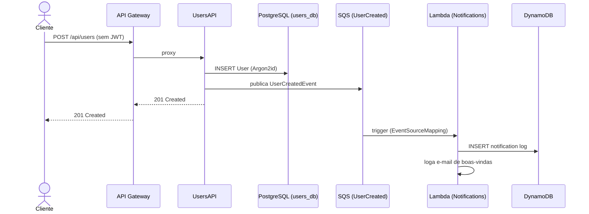
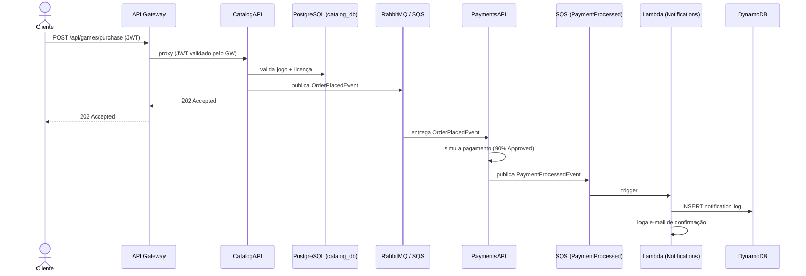

# FiapCloudGames — Orquestração

Repositório central de orquestração da plataforma **FiapCloudGames**: Docker Compose para desenvolvimento local, manifests Kubernetes para produção e infraestrutura AWS como código (SAM).

---

## Sumário

- [Evolução da Arquitetura](#evolução-da-arquitetura)
- [Fase 3 — Arquitetura AWS (atual)](#fase-3--arquitetura-aws-atual)
- [Stack de Tecnologias](#stack-de-tecnologias)
- [Fluxos de Eventos](#fluxos-de-eventos)
- [Executando com Docker Compose](#executando-com-docker-compose)
- [Deploy no Kubernetes](#deploy-no-kubernetes)
- [Deploy AWS (SAM)](#deploy-aws-sam)
- [Observabilidade — Datadog APM](#observabilidade--datadog-apm)
- [Repositórios dos Microsserviços](#repositórios-dos-microsserviços)

---

## Evolução da Arquitetura

| Fase | Descrição | Destaque |
|------|-----------|---------|
| **Fase 1** | Monolito .NET 8 | Banco único, sem mensageria |
| **Fase 2** | Microsserviços + RabbitMQ | 4 serviços independentes, MassTransit, K8s |
| **Fase 3** | Arquitetura AWS profissional | Lambda, SQS, DynamoDB, API GW, Redis, Observabilidade |

---

## Fase 3 — Arquitetura AWS (atual)

```
                    ┌─────────────────────────────────┐
                    │       AWS API Gateway            │
                    │   (JWT Authorizer + Roteamento)  │
                    └────────────┬────────────┬────────┘
                                 │            │
              ┌──────────────────▼──┐    ┌────▼─────────────────┐
              │      UsersAPI       │    │      CatalogAPI       │
              │   (K8s / EKS)       │    │    (K8s / EKS)        │
              │  ┌───────────────┐  │    │  ┌────────────────┐   │
              │  │ PostgreSQL    │  │    │  │ PostgreSQL     │   │
              │  │ (RDS)         │  │    │  │ (RDS)          │   │
              │  └───────────────┘  │    │  └────────────────┘   │
              │  ┌───────────────┐  │    │  ┌────────────────┐   │
              │  │ Redis Cache   │◄─┼────┼─►│ Redis Cache    │   │
              │  │ (ElastiCache) │  │    │  │ (ElastiCache)  │   │
              │  └───────────────┘  │    │  └────────────────┘   │
              └──────────┬──────────┘    └────────┬──────────────┘
                         │                        │
                         │  publica               │  publica
                         ▼                        ▼
              ┌─────────────────┐      ┌─────────────────────────┐
              │ SQS Queue       │      │ PaymentsAPI (K8s / EKS) │
              │ UserCreated     │      │  └─► SQS Queue          │
              │ Events          │      │      PaymentProcessed   │
              └────────┬────────┘      │      Events             │
                       │               └────────────┬────────────┘
                       │                            │
                       └──────────┬─────────────────┘
                                  │ trigger
                                  ▼
                    ┌─────────────────────────────────┐
                    │       AWS Lambda                 │
                    │   NotificationsFunction          │
                    │   (fcg-notifications-production) │
                    │                                  │
                    │  ┌───────────────────────────┐  │
                    │  │ DynamoDB                  │  │
                    │  │ fcg-notifications          │  │
                    │  │ (log de notificações)      │  │
                    │  └───────────────────────────┘  │
                    └─────────────────────────────────┘

                    ┌─────────────────────────────────┐
                    │   Observabilidade — Datadog      │
                    │   APM + Logs + Traces + Metrics  │
                    │   (Agent DaemonSet no K8s +      │
                    │    Datadog Extension na Lambda)  │
                    └─────────────────────────────────┘
```

---

## Stack de Tecnologias

### API Gateway
- **AWS API Gateway (HTTP API v2)** — ponto de entrada único, JWT Authorizer nativo, roteamento para UsersAPI e CatalogAPI
- Configuração: `infrastructure/sam/template.yaml`

### Serverless — NotificationsAPI
- **AWS Lambda** (.NET 8, arm64) — substitui o container que rodava continuamente
- **Trigger**: Amazon SQS (EventSourceMapping direto, sem polling manual)
- **Persistência**: Amazon DynamoDB (persistência poliglota — NoSQL)
- Código: repositório [NotificationsAPI](https://github.com/heroshg/NotificationsAPI)
- IaC: `infrastructure/sam/template.yaml`

### Mensageria
| Ambiente | Broker |
|----------|--------|
| Desenvolvimento local | RabbitMQ 3.13 (Docker) |
| Produção AWS | Amazon SQS (gerenciado, sem servidor) |

### Cache
- **Redis 7.2** via `StackExchange.Redis` / `IDistributedCache` do ASP.NET Core
- Desenvolvimento: container Docker
- Produção AWS: Amazon ElastiCache for Redis

### Persistência Poliglota
| Serviço | Banco |
|---------|-------|
| UsersAPI | PostgreSQL (RDS) |
| CatalogAPI | PostgreSQL (RDS) |
| PaymentsAPI | PostgreSQL (RDS) |
| NotificationsAPI | **DynamoDB** (NoSQL — log de notificações) |

### Observabilidade — Opção B (Datadog APM)
- **Datadog Agent 7.58** — DaemonSet no K8s que coleta traces (APM), métricas e logs de todos os containers
- **Datadog .NET Tracer** (`Datadog.Trace.Bundle` NuGet) — auto-instrumentation de ASP.NET Core, EF Core, Npgsql, StackExchange.Redis, MassTransit/RabbitMQ, HttpClient, sem mudança de código
- **Datadog Lambda Extension** — layer pública (`Datadog-Extension-ARM`) anexada à Lambda de Notificações para forwarding de traces, logs e métricas diretamente da AWS
- **API Key** gerenciada via Kubernetes Secret (`datadog-secret`) e AWS SAM Parameter (`NoEcho`)
- Deploy K8s: manifest único em `k8s/datadog-agent.yaml`
- Cobertura dos 3 pilares: métricas (APM + runtime metrics), logs (`DD_LOGS_INJECTION=true` correlaciona trace_id/span_id), traces distribuídos (incluindo o fluxo "Compra de Jogo": API Gateway → CatalogAPI → RabbitMQ → PaymentsAPI → SQS → Lambda → DynamoDB)

---

## Fluxos de Eventos

### 1. Cadastro de Usuário



### 2. Compra de Jogo (fluxo completo)



---

## Executando com Docker Compose

### Pré-requisitos
- Docker Desktop com Compose

### Iniciar todos os serviços

```bash
cp .env.example .env   # edite as variáveis (inclui DD_API_KEY)
docker compose up --build
```

> **Datadog local**: o `datadog-agent` só sobe corretamente com uma `DD_API_KEY` válida.
> Se quiser rodar sem Datadog, comente o serviço `datadog-agent` no `docker-compose.yml`
> e remova as envs `DD_*` dos 3 microsserviços.

### URLs disponíveis

| Serviço | URL |
|---------|-----|
| UsersAPI (Swagger) | http://localhost:5001/swagger |
| CatalogAPI (Swagger) | http://localhost:5002/swagger |
| PaymentsAPI (health) | http://localhost:5003/health |
| RabbitMQ Management | http://localhost:15672 |
| Redis | localhost:6379 |
| users-postgres | localhost:5432 |
| catalog-postgres | localhost:5433 |
| payments-postgres | localhost:5434 |

> **NotificationsAPI não está no Docker Compose** — foi migrada para AWS Lambda.
> Para testar localmente: `sam local invoke` no repositório NotificationsAPI.

### Credenciais de teste (seed automático)

| E-mail | Senha | Role |
|--------|-------|------|
| `admin@fgc.com` | `Admin@123` | Admin |
| `testplayer@fgc.com` | `Test@123` | User |

---

## Deploy no Kubernetes

### Pré-requisitos
- `kubectl` + cluster (Docker Desktop / Minikube / Kind / EKS)

### 1. Build das imagens

```bash
docker build -t users-api:latest    ../UsersAPI
docker build -t catalog-api:latest  ../CatalogAPI
docker build -t payments-api:latest ../PaymentsAPI
```

### 2. Aplicar manifests

```bash
kubectl apply -f k8s/namespace.yaml
kubectl apply -f k8s/ -n fcg
```

### 3. Verificar pods

```bash
kubectl get pods     -n fcg
kubectl get services -n fcg
```

### 4. Port-forward (acesso local)

```bash
kubectl port-forward svc/users-api   5001:80   -n fcg
kubectl port-forward svc/catalog-api 5002:80   -n fcg
kubectl port-forward svc/rabbitmq    15672:15672 -n fcg
# Dashboards de observabilidade ficam em https://app.datadoghq.com/
```

### Estrutura dos manifests K8s

```
k8s/
├── namespace.yaml              # namespace: fcg
├── rabbitmq.yaml               # Broker (desenvolvimento local em K8s)
├── redis.yaml                  # Cache distribuído
├── datadog-agent.yaml          # Observabilidade — APM + Logs + Metrics (DaemonSet)
├── users-postgres.yaml
├── catalog-postgres.yaml
├── payments-postgres.yaml
├── users-api.yaml
├── catalog-api.yaml
├── payments-api.yaml
└── network-policies.yaml       # Isolamento de rede por serviço
```

---

## Deploy AWS (SAM)

A infraestrutura AWS é gerenciada via **AWS SAM** (`infrastructure/sam/template.yaml`).

### O que é provisionado

| Recurso | Descrição |
|---------|-----------|
| `AWS::ApiGatewayV2::Api` | API Gateway HTTP com JWT Authorizer |
| `AWS::SQS::Queue` | Fila `fcg-user-created-events-production` |
| `AWS::SQS::Queue` | Fila `fcg-payment-processed-events-production` |
| `AWS::SQS::Queue` | DLQs para cada fila (retenção 14 dias) |
| `AWS::Serverless::Function` | Lambda `fcg-notifications-production` |
| `AWS::DynamoDB::Table` | `fcg-notifications-production` (NoSQL) |
| `AWS::IAM::Role` | Role com políticas mínimas (least privilege) |
| `AWS::Logs::LogGroup` | Logs da Lambda (retenção 14 dias) |

### Pré-requisitos

```bash
# AWS CLI
aws configure

# SAM CLI
pip install aws-sam-cli
# ou: brew install aws-sam-cli

# .NET 8 SDK
dotnet --version  # >= 8.0
```

### Deploy

```bash
cd infrastructure/sam

# Opção 1 — Script automatizado
export ENVIRONMENT=production
export USERS_API_URL=https://seu-lb.amazonaws.com
export CATALOG_API_URL=https://seu-lb.amazonaws.com
export JWT_KEY=sua-chave-jwt-minimo-32-chars
export AWS_REGION=us-east-1
export DD_API_KEY=xxxxxxxxxxxxxxxxxxxxxxxxxxxxxxxx
export DD_SITE=datadoghq.com
bash deploy.sh

# Opção 2 — SAM CLI direto
sam build
sam deploy --guided
```

### Após o deploy

O SAM exibirá os Outputs. Copie as URLs das filas SQS e configure nos serviços publicadores:

```
UsersAPI   → AWS__SQS__UserCreatedQueueUrl    = <UserCreatedEventQueueUrl>
PaymentsAPI → AWS__SQS__PaymentProcessedQueueUrl = <PaymentProcessedEventQueueUrl>
```

O **ApiGatewayUrl** é o novo ponto de entrada único do sistema.

---

## Observabilidade — Datadog APM

### Stack escolhida: Opção B — APM gerenciado

| Componente | Função |
|------------|--------|
| **Datadog Agent 7.58** (DaemonSet K8s) | Recebe traces APM (porta 8126/tcp) e métricas DogStatsD (8125/udp), coleta logs de containers via autodiscovery |
| **Datadog .NET Tracer** (`Datadog.Trace.Bundle`) | Auto-instrumentation de ASP.NET Core, EF Core, Npgsql, StackExchange.Redis, MassTransit, HttpClient — zero mudança de código |
| **Datadog Lambda Extension** (layer ARM64) | Envia traces, logs e métricas diretamente da Lambda para o Datadog |

### Os três pilares da observabilidade

**1. Métricas** — APM automático (`trace.aspnet_core.request`, `trace.npgsql.command`), runtime .NET (`runtime.dotnet.*`), dashboards APM built-in:
- RPS / throughput por serviço
- Latência P50/P95/P99 por endpoint
- Taxa de erros (4xx / 5xx)
- Resource utilization por rota
- JIT, GC pauses, thread pool

**2. Logs** — Serilog → stdout → Datadog Agent coleta via autodiscovery de containers. `DD_LOGS_INJECTION=true` injeta `dd.trace_id` e `dd.span_id` em todas as entradas via `LogContext`, permitindo correlacionar log → trace com um clique. A Lambda envia logs via Extension sem passar pelo CloudWatch.

**3. Traces distribuídos** — Captura o fluxo "Compra de Jogo" completo:
```
API Gateway → CatalogAPI (HTTP) → RabbitMQ (span producer)
            → PaymentsAPI (consume) → SQS (span producer)
            → Lambda Notifications → DynamoDB (span db)
```
Visível em **APM → Traces → Service Map** do Datadog.

### Pré-requisitos — API key

Obtenha a API key em https://app.datadoghq.com/organization-settings/api-keys e configure:

**Desenvolvimento local (Docker Compose)**
```bash
# .env
DD_API_KEY=xxxxxxxxxxxxxxxxxxxxxxxxxxxxxxxx
DD_SITE=datadoghq.com
```

**Kubernetes** — crie o Secret antes de aplicar os manifests:
```bash
kubectl create secret generic datadog-secret \
  --from-literal=api-key=xxxxxxxxxxxxxxxxxxxxxxxxxxxxxxxx \
  -n fcg
kubectl apply -f k8s/datadog-agent.yaml
```

**AWS Lambda** — a chave é passada via parâmetro SAM `NoEcho`:
```bash
export DD_API_KEY=xxxxxxxxxxxxxxxxxxxxxxxxxxxxxxxx
export DD_SITE=datadoghq.com
bash infrastructure/sam/deploy.sh
```

### Acesso aos dashboards

Toda a observabilidade fica em **https://app.datadoghq.com/**:
- APM → Services: `users-api`, `catalog-api`, `payments-api`, `fcg-notifications-production`
- APM → Traces: filtro `service:catalog-api resource_name:POST /api/games/purchase` para achar o trace da compra
- APM → Service Map: mostra topologia e dependências (Postgres, Redis, RabbitMQ, SQS, DynamoDB)
- Logs: query `service:catalog-api env:production`
- Dashboards → New → "APM Service Overview" (template pronto)

> **Nota**: os logs da Lambda **não passam mais por CloudWatch** — vão direto para o Datadog via Extension. O log group `/aws/lambda/fcg-notifications-*` é mantido apenas para auditoria básica.

---

## Contratos de Eventos

| Evento | Produtor | Consumidores |
|--------|----------|--------------|
| `UserCreatedEvent` | UsersAPI | Lambda (SQS) |
| `OrderPlacedEvent` | CatalogAPI | PaymentsAPI |
| `PaymentProcessedEvent` | PaymentsAPI | CatalogAPI, Lambda (SQS) |

```
UserCreatedEvent(UserId, Name, Email)
OrderPlacedEvent(OrderId, UserId, UserEmail, GameId, GameName, Price)
PaymentProcessedEvent(OrderId, UserId, UserEmail, GameId, GameName, Price, Status)
```

---

## Repositórios dos Microsserviços

| Serviço | Repositório |
|---------|-------------|
| UsersAPI | [heroshg/UsersAPI](https://github.com/heroshg/UsersAPI) |
| CatalogAPI | [heroshg/CatalogAPI](https://github.com/heroshg/CatalogAPI) |
| PaymentsAPI | [heroshg/PaymentsAPI](https://github.com/heroshg/PaymentsAPI) |
| NotificationsAPI (Lambda) | [heroshg/NotificationsAPI](https://github.com/heroshg/NotificationsAPI) |
