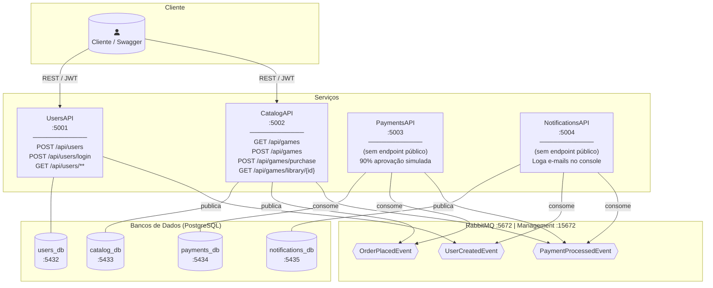
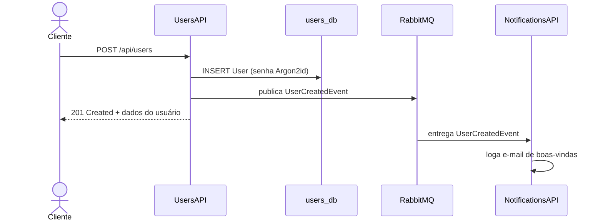
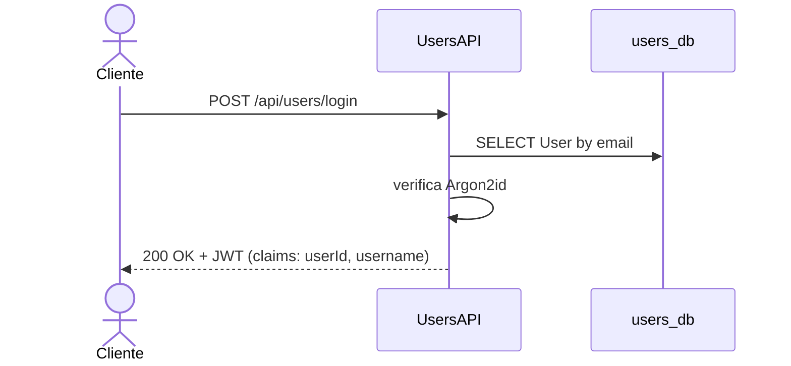
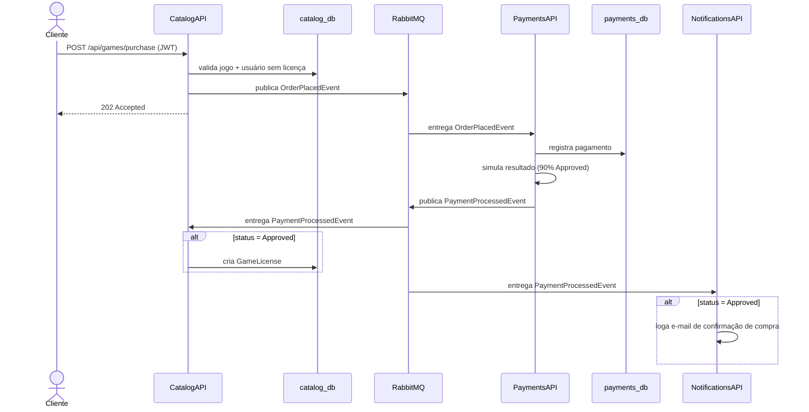

# FiapCloudGames — Orquestração

Repositório central de orquestração da plataforma **FiapCloudGames**: Docker Compose para desenvolvimento local e manifests Kubernetes para produção.

---

## Sumário

- [Evolução: Monolito → Microsserviços](#evolução-monolito--microsserviços)
- [Arquitetura dos Microsserviços](#arquitetura-dos-microsserviços)
- [Fluxos de Eventos](#fluxos-de-eventos)
- [Isolamento de Rede](#isolamento-de-rede)
- [Executando com Docker Compose](#executando-com-docker-compose)
- [Deploy no Kubernetes](#deploy-no-kubernetes)
- [Repositórios dos Microsserviços](#repositórios-dos-microsserviços)

---

## Evolução: Monolito → Microsserviços

### Fase 1 — Monolito (FiapCloudGames v1)

Aplicação única em .NET 8 com Clean Architecture e CQRS, banco de dados centralizado.

```
┌─────────────────────────────────────────────────┐
│               FiapCloudGames (monolito)          │
│                                                  │
│  ┌──────────┐  ┌──────────┐  ┌──────────────┐   │
│  │  Users   │  │  Games   │  │   Orders /   │   │
│  │  Module  │  │  Module  │  │  Payments    │   │
│  └──────────┘  └──────────┘  └──────────────┘   │
│                                                  │
│  NetDevPack.SimpleMediator · Argon2id · Serilog  │
└─────────────────────┬───────────────────────────┘
                      │
              ┌───────▼────────┐
              │  PostgreSQL    │
              │  (único banco) │
              └────────────────┘
```

| Característica        | Monolito                          |
|-----------------------|-----------------------------------|
| Implantação           | Processo único                    |
| Banco de dados        | PostgreSQL único, schema único    |
| Mensageria            | Sem broker (síncrono)             |
| CQRS                  | NetDevPack.SimpleMediator         |
| Hash de senha         | Argon2id                          |
| Escalabilidade        | Vertical (toda a aplicação)       |
| Observabilidade       | Serilog local                     |

---

### Fase 2 — Microsserviços (Tech Challenge)

Decomposição em 4 serviços independentes, comunicação assíncrona via RabbitMQ, bancos de dados isolados por serviço e suporte a orquestração em Kubernetes.

| Característica        | Microsserviços                            |
|-----------------------|-------------------------------------------|
| Implantação           | 4 containers independentes                |
| Banco de dados        | 1 PostgreSQL por serviço (DB isolation)   |
| Mensageria            | RabbitMQ + MassTransit                    |
| CQRS                  | MediatR                                   |
| Hash de senha         | Argon2id (mantido)                        |
| Escalabilidade        | Horizontal por serviço                    |
| Observabilidade       | Serilog + health checks                   |
| Infraestrutura        | Docker Compose / Kubernetes               |
| Segurança             | Network policies, read-only containers    |

**O que mudou em detalhes:**

- `NetDevPack.SimpleMediator` → **MediatR** (maior ecossistema, suporte a behaviors)
- Banco único → **4 bancos isolados** (`users_db`, `catalog_db`, `payments_db`, `notifications_db`)
- Chamadas síncronas → **eventos assíncronos** via RabbitMQ (desacoplamento total)
- Deploy manual → **docker-compose + Kubernetes** com namespace dedicado (`fcg`)
- Rede plana → **redes Docker segregadas por serviço** + NetworkPolicies no K8s
- Containers com `read_only: true` + `no-new-privileges` (hardening)
- Auto-migration no startup (`db.Database.Migrate()`)

---

## Arquitetura dos Microsserviços



---

## Fluxos de Eventos

### 1. Cadastro de Usuário



### 2. Login



### 3. Compra de Jogo (fluxo completo)



---

## Isolamento de Rede

Cada serviço acessa **apenas** sua própria rede de banco de dados, além da rede de mensageria compartilhada.

```
┌─────────────────────────────────────────────────────────┐
│  rede: messaging (RabbitMQ)                             │
│  users-api ──┬── catalog-api ──┬── payments-api ──┬── notifications-api
└──────────────┼─────────────────┼──────────────────┼─────────────────────┘
               │                 │                  │
    ┌──────────▼───┐   ┌─────────▼──┐   ┌──────────▼───┐   ┌──────────────┐
    │ rede:        │   │ rede:      │   │ rede:        │   │ rede:        │
    │ users-db     │   │ catalog-db │   │ payments-db  │   │notifications │
    │ users-       │   │ catalog-   │   │ payments-    │   │ -db          │
    │ postgres     │   │ postgres   │   │ postgres     │   │ notif-       │
    └──────────────┘   └────────────┘   └──────────────┘   │ postgres     │
                                                            └──────────────┘
```

No Kubernetes, as mesmas regras são aplicadas via `NetworkPolicy` (manifests em `k8s/network-policies.yaml`).

---

## Executando com Docker Compose

### Pré-requisitos

- Docker Desktop com Compose

### Iniciar todos os serviços

```bash
# Na raiz deste repositório
cp .env.example .env   # edite as variáveis conforme necessário
docker-compose up --build
```

### URLs disponíveis

| Serviço                   | URL                                      |
|---------------------------|------------------------------------------|
| UsersAPI (Swagger)        | http://localhost:5001/swagger            |
| CatalogAPI (Swagger)      | http://localhost:5002/swagger            |
| PaymentsAPI (health)      | http://localhost:5003/health             |
| NotificationsAPI (health) | http://localhost:5004/health             |
| RabbitMQ Management       | http://localhost:15672  (guest / guest)  |
| users-postgres            | localhost:5432                           |
| catalog-postgres          | localhost:5433                           |
| payments-postgres         | localhost:5434                           |
| notifications-postgres    | localhost:5435                           |

### Credenciais de teste (seed automático)

| E-mail                  | Senha      | Role  |
|-------------------------|------------|-------|
| `admin@fgc.com`         | `Admin@123`| Admin |
| `testplayer@fgc.com`    | `Test@123` | User  |

---

## Deploy no Kubernetes

### Pré-requisitos

- `kubectl` + cluster local (Docker Desktop / Minikube / Kind)

### 1. Build das imagens locais

```bash
docker build -t users-api:latest         ../UsersAPI
docker build -t catalog-api:latest       ../CatalogAPI
docker build -t payments-api:latest      ../PaymentsAPI
docker build -t notifications-api:latest ../NotificationsAPI
```

### 2. Criar namespace e aplicar manifests

```bash
kubectl apply -f k8s/namespace.yaml
kubectl apply -f k8s/ -n fcg
```

### 3. Verificar os pods

```bash
kubectl get pods     -n fcg
kubectl get services -n fcg
```

### 4. Acessar localmente via port-forward

```bash
# UsersAPI
kubectl port-forward svc/users-api    5001:80 -n fcg

# CatalogAPI
kubectl port-forward svc/catalog-api  5002:80 -n fcg

# RabbitMQ Management
kubectl port-forward svc/rabbitmq    15672:15672 -n fcg
```

### Estrutura dos manifests K8s

```
k8s/
├── namespace.yaml            # namespace: fcg
├── rabbitmq.yaml             # Deployment + Service
├── users-postgres.yaml       # Deployment + Service + PVC
├── catalog-postgres.yaml
├── payments-postgres.yaml
├── notifications-postgres.yaml
├── users-api.yaml            # Deployment + Service + ConfigMap + Secret
├── catalog-api.yaml
├── payments-api.yaml
├── notifications-api.yaml
└── network-policies.yaml     # isolamento de rede por serviço
```

---

## Contratos de Eventos

Todos os eventos vivem no namespace `FiapCloudGames.Contracts.Events` e são duplicados em cada serviço que os produz ou consome.

| Evento                   | Produtor      | Consumidores                       |
|--------------------------|---------------|------------------------------------|
| `UserCreatedEvent`       | UsersAPI      | NotificationsAPI                   |
| `OrderPlacedEvent`       | CatalogAPI    | PaymentsAPI                        |
| `PaymentProcessedEvent`  | PaymentsAPI   | CatalogAPI, NotificationsAPI       |

```
UserCreatedEvent(UserId, Name, Email)
OrderPlacedEvent(OrderId, UserId, UserEmail, GameId, GameName, Price)
PaymentProcessedEvent(OrderId, UserId, UserEmail, GameId, GameName, Price, Status)
```
| Serviço | Repositório |
|---------|-------------|
| UsersAPI | [UsersAPI](https://github.com/heroshg/UsersAPI) |
| CatalogAPI | [CatalogAPI](https://github.com/heroshg/CatalogAPI) |
| PaymentsAPI | [PaymentsAPI](https://github.com/heroshg/PaymentsAPI) |
| NotificationsAPI | [NotificationsAPI](https://github.com/heroshg/NotificationsAPI) |
